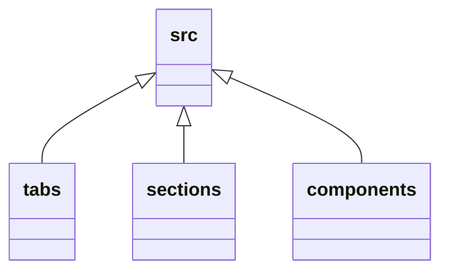
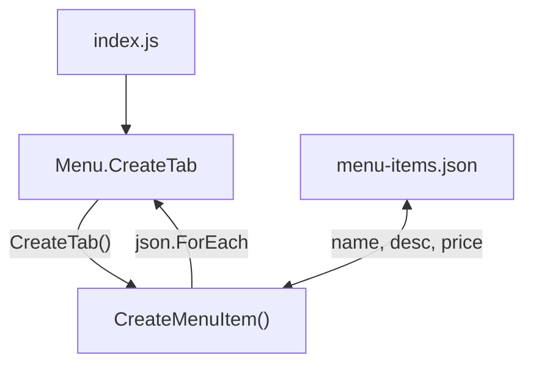

# Simple Restaurant Page - Built using ES6 modules, NPM and Webpack
A simple restaurant page, with tabs, built using ES6 modules and Webpack.

## The structure
### Tools used:
|Tool | Description |
|----------------|-------------------------------------------|
| Javascript | The language that this website was written in. |
| NPM | The package manager used to install packages into the repo. |
| Webpack | A node package used to bundle all of the modules into one bundled JS file. |
| Webpack Style & CSS loader | Webpack modules that enables CSS to be loaded into JS modules. |
| Webpack HTML plugin | Webpack plugin that enables you to generate an HTML file, that then includes all the neccessary code, so you don't have to do it yourself. |

### The structure
This site was made using ES6 modules. All of the code was generated, including the `index.html` file.
The source (`./src`) folder includes the following subdirectories:

These subdirectories contain the JS files for all of the reusable ES6 modules that were created and used to make this site.
The general idea was this:
* `COMPONENTS` should be reusuable chucks used inside of sections.
* `SECTIONS` should be reusable components used inside of tabs.
* And `TABS` are collections of sections used to display the dynamic front end content of the site, inside of the div#content tag in index.html.

The file named `index.js` inside of the `./src` directory works as the main entry point for this front end application.
Index.js takes care of the actual rendering of the tabs, and their content - it also manages the logic behind which tab should be visible, depending on which of the nav links that has been pressed.

### The tab logic
The tab logic was very simple. When one of the links inside of the navigation bar has been pressed a callback function, inside of `index.js`, is called. 
The function then checks the ID of the clicked link and displays the corresponding tab.
To display the new tab, it uses the `parentNode.replaceChildren()` method, in order to actually replace the currently visible tab with the newly requested one.

### Caching the tabs
In order to save memory, and not have to generate new content each time a tab has been requested, the tabs are first put into memory, using each tab object's `CreateTab()` method. This works because of the fact that each tab is an IIFE Factory Function object  (essentially singletons). So when each tab is instantiated (which happens on its own, since the tabs are IIFE's), the `CreateTab()` function creates all of the needed elements (using `document.createElement()`) and stores them as fields, to be used later.

In order to actually use the cached tab elements, the `GetTab()`method has to be called on the respective tab object. This function returns the tab content, in one div.

### The menu "database"
The last interesting fact of this site is that the menu tab is not hard coded.

This is how it works:
The menu tab is a collection of menu item components. Each menu item component is created using a factory function that takes the name, description and the price of a menu item as arguments.

Inside of the `./src/assets/`directory exists a JSON file called `menu-items.json`. This JSON file contains an array that describes the menu. Each array item includes fields for, you guessed it, name, description and price of each menu item.
So to make the site interesting I decided to use this JSON file as a kind of database.

So when populating the menu tab, when `CreateTab()` is called, the menu tab object loops through the above mentioned JSON file and creates one menu item component for each item inside of the JSON array.  

This was the best way I was able to visualize it using mermaid:

 